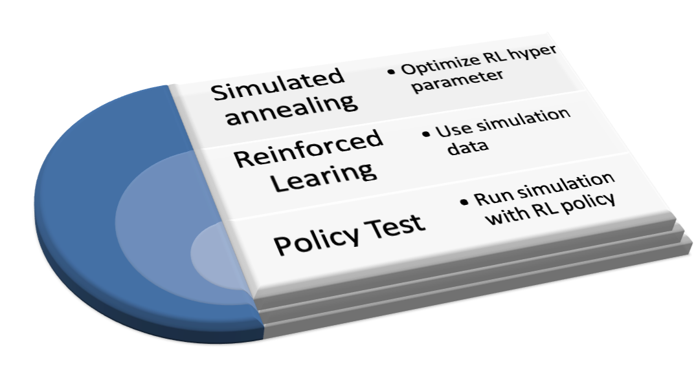

## Introduction
In the following an example for a hyper parameter optimization for a Reinforced Learning (RL) model is presented. The optimization is performed applying simulated annealing. Code snippets illustrate how an implementation in R looks like, however, the concept could be easily implemented in other programming languages.

The best policy for a system can be found by RL. Necessary input data are:

- state
- action
- next state
- reward

As for most machine learning algorithms choosing the hyper parameters is not very intuitive. However, wrapping the reinforcement learning by a simulated annealing loop the ideal combination can be determined.



## Create trainings data

First step is to create trainings data for the RL algorithm. Training data can be created by a simulation of the system which logs the four needed quantities.  
For complex systems a reduced simulation might be used for the optimization of the hyper parameters to speed up the process. The function **Sim** runs the simulation and returns trainings data. The number of iterations ought to be high enough to make sure each state of the system is visited at least once. The definition of the states is crucial because the states have to describe the system well, however, if the number of states is getting large than it becomes more difficult to find the optimal policy.

```
SimulationData <- Sim(dataFile, iterations, trainFlag, colNames)
```

## Create RL model

The trainings data and the actions are the inputs of the RL algorithm which is part of the function **optFunc** in which

- reinforced learning model RlModel is calculated
- The policy of RlModel is applied in the simulation 
- The metric **rlModelResult** is calculated

The RL policy is applied in the same simulation implemented in the **Sim** function which was used to create the trainings data, instead of random selection of actions now the actions are performed based on the defined policy for a state.

The function **optFunc** will be called for each iteration of the simulated annealing. The return value **rlModelResult** is the value which is minimized in the optimization loop.

```
optFunc <- function(par, dataFile, SimulationData, ActionFunctionsDf){
  alpha <- par[[1]]
  gamma <-  par[[2]]
  epsilon <- par[[3]]
  control <- list(alpha = alpha, gamma = gamma, epsilon = epsilon)
  RlModel <- ReinforcementLearning(SimulationData,
                                   s = "State",
                                   a = "Action",
                                   r = "Reward",
                                   s_new = "NextState",
                                   iter = 3,
                                   control = control)
  
  rlModelResult <- Sim(dataFile, iterations, trainFlag, colNames, RlModel = RlModel)
    
  return(rlModelResult)  
}
```
## Apply simulated annealing
 
The metric **rlModelResult** is minimized using simulated annealing. The optimizing parameter can be freely chosen, different sets of actions and states could be used as parameters.   
 
In this case the optimization parameters are the hyper parameters of the **[ReinforcementLearning](https://www.rdocumentation.org/packages/ReinforcementLearning/versions/1.0.2/topics/ReinforcementLearning)** function.

Note, **SimulationData** is the data generated by the simulation. The parameters **par** are changed for each iterations of the simulated annealing. 

```
sa_out <- GenSA(par = suggestions,   
                fn = optFunc,  
                lower = minOpt,    
                upper = maxOpt,  
                control=list(nb.stop.improvement = 3,    
                             smooth = TRUE),   
                SimulationData = SimulationData,
                ActionFunctionsDf =  ActionFunctionsDf  
)
```

The optimal hyper parameter set for the given task is:
  
- alpha:	 0.859   
- gamma:	 0.378  
- epsilon: 0.969

The definitions of the parameters are given below.

• **alpha** The learning rate, set between 0 and 1. Setting it to 0 means that the Q-values are never updated and, hence, nothing is learned.

• **gamma** Discount factor, set between 0 and 1. Determines the importance of future rewards. 

• **epsilon** Exploration parameter. Defines the exploration mechanism in ε-greedy action selection. 


## Packages

### ReinforcementLearning  

For reinforcement learning **[ReinforcementLearning](https://cran.r-project.org/web/packages/ReinforcementLearning/index.html)**  
Performs model-free reinforcement learning in R. This implementation enables the learning
of an optimal policy based on sample sequences consisting of states, actions and rewards. In addition, it supplies multiple predefined reinforcement learning algorithms, such as experience replay.

### GenSa
For simmulated annealing **[GenSa](https://cran.r-project.org/web/packages/GenSA/index.html)**  
Implementation of a function that searches for global minimum of a very complex non-linear objective function with a very large number of optima.
