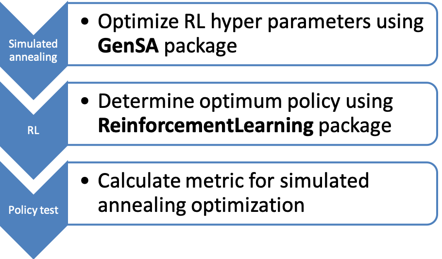

# Tuning reinforcement learning hyper parameters using simulated annealing

To determine the best policy for a system reinforced learning (RL) can be applied, necessary input data is:

- state
- action
- next state
- reward

As for most machine learing algorithms choosing the hyper parameters is not very intuitive. However, wrapping the reinforcement learning by a simulated annealing loop the ideal combination can be determined.




First step is to create trainings data for the reinforced learning algorithm. Training data can be created by a simulation of the system which logs the four needed quantaties.  
For complex systems a reduced simulation might be used for the optimization of the hyper parameters to speed up the process.

```
SimulationData <- spatialAcqSim(dataFile, PlotsAll,Tuc,  
iterations, trainFlag, maxNumberOfSpirals, colNames)
```

The trainings data is one of the inputs of the reinforcement learning algorithm which is part of the function **optFunc** in which

- reinforced learning model RlModel is calculated
- The policy of RlModel is applied in the simulation 


```
optFunc <- function(par, dataFile, SummaryDataDf, ActionFunctionsDf){

   RlModel <- rlTraining(par, dataFile, SummaryDataDf, ActionFunctionsDf)
  
  rlModelResult <- spatialAcqSim(dataFile, PlotsAll,Tuc, iterations,
   trainFlag, maxNumberOfSpirals, colNames, RlModel = RlModel)
    
  return(rlModelResult)
  
}
```
 
The metric rlModelResult is minimized using simulated annealing. The optimizing parameter can be freely choosen, different sets of actions and states could be used. Note, **SimulationData** is the data generated by the simulation.

```
sa_out <- GenSA(par = suggestions,   
                fn = optFunc,  
                lower = minOpt,    
                upper = maxOpt,  
                control=list(max.time =100,  
                             maxit =3,   
                             nb.stop.improvement = 3,    
                             smooth = TRUE, verbose = TRUE),   
                SimulationData = SimulationData,
                ActionFunctionsDf =  ActionFunctionsDf  
)
```
In this case the optimization parameters are the hyper parameters of the **ReinforcementLearning** function.

```
  alpha <- par[[1]]
  gamma <-  par[[2]]
  epsilon <- par[[3]]
  control <- list(alpha = alpha, gamma = gamma, epsilon = epsilon)
  RlModel <- ReinforcementLearning(SummaryDataDf,
                                   s = "State",
                                   a = "Action",
                                   r = "Reward",
                                   s_new = "NextState",
                                   iter = 3,
                                   control = control)
```
The definition of the parameters are given below.

• **alpha** The learning rate, set between 0 and 1. Setting it to 0 means that the Q-values are never updated and, hence, nothing is learned.


• **gamma** Discount factor, set between 0 and 1. Determines the importance of future rewards. 

• **epsilon** Exploration parameter. Defines the exploration mechanism in ε-greedy action selection. 


## Packages

### ReinforcementLearning  

For reinforcement learning **ReinforcementLearning**  
Performs model-free reinforcement learning in R. This implementation enables the learning
of an optimal policy based on sample sequences consisting of states, actions and rewards. In addition, it supplies multiple predefined reinforcement learning algorithms, such as experience replay.

### GenSa
For simmulated annealing **GenSa**  
Implementation of a function that searches for global minimum of a very complex non-linear ob- jective function with a very large number of optima.


